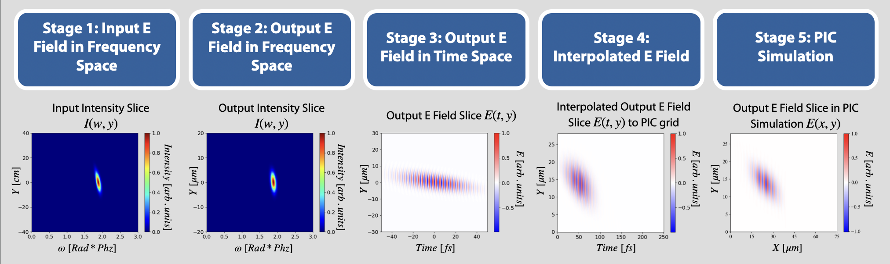

# About
This code enables the use of accurately focused arbitrary beam structures in particle-in-cell (PIC) simulations. The code
provides significant flexibility for simulating focused beams with complex space, time, and polarization couplings
in PIC simulations.

## Workflow

There are 5 primary stages of generating the custom laser fields in PIC simulations that this code handles:
1. Input E field in frequency space
2. Output E field in frequency space
3. Output E field in time space
4. Interpolated output E field to the PIC grid
5. PIC simulation of the field

## Using the Code
Note: All units are in microns and femtoseconds.

For stages (1-4), the notebook `/notebooks/Tutorial.ipynb` covers all of the steps to create your own laser object, propagate it,
and how to plot/visualize it. For a complete look at stages (1-5) as it would be run on a high-performance computing cluster, 
see `/tutorial_sim/README.md`. It covers using the code with the PIC software 
[Smilei](https://smileipic.github.io/Smilei/index.html) that then simulates
the user defined laser.

### Dependencies
For stages (1-3):
For non-parallel computation, only the following packages are used:
* Python3
* numpy
* scipy
* pickle

For parallel computation, the following is additionally required:
* mpi4py

Git is assumed to be installed as well.

### Interacting with the Code
In the directory you want to download and use this code, run `git clone https://github.com/kcharbo3/Arbitrary-Laser-Fields-for-PIC.git`.
Once the download is complete, you can navigate to `/notebooks/Tutorial.ipynb` and play around with the notebook code to interact
with this code. If you cloned this code to an HPC with Smilei installed, you can navigate to `/tutorial_sims/README.md` to 
test the full workflow of running this code with a PIC simulation.

## Stages in more detail
### Fourier Propagation (Stages 1-3)
**Stage 1** is where the user defines their custom parameters for the laser field and for the propagation of that laser field. 
This includes setting parameters that define the input grid (Y, Z, T/W grid at the focusing optic entrance), the output grid
(Y, Z, T/W grid at the propagation distance from the focusing optic), polarization type, spot size, etc. Once all of the parameters
are set, the input grid is populated with the laser field values `E(Y, Z, W)` in frequency space. This defines the laser field
just before focusing (at the focusing optic entrance).

**Stage 2** is where the input laser field is propagated after focusing to some user-defined propagation distance. This step
will populate the output grid with the laser field values `E(Y, Z, W)` in frequency space. This defines the laser field after the
focusing optic.

**Stage 3** is where the output laser field is converted to the time space by FFTs. So the output grid will be populated with the
laser field values `E(Y, Z, T)` in time space.

### Interpolation (Stage 4)
**Stage 4** is where the output laser field `E(Y, Z, T)` is interpolated to the PIC simulation grid. Since PIC simulations often require
very high resolution grids, these values are usually output to files (set by `propagation_parameters.save_as_files`).

### PIC Simulation (Stage 5)
**Stage 5** reads the output files from stage 4 and hands the values over to the PIC simulation software as requested. The PIC simulation
will use a custom laser field block where the user can enter their own laser field values. The field values must be defined at the 
laser entrance window (`X = Position_of_laser_entrance_window`) as a function of `Y, Z, T`. As the PIC simulation runs, it reads the
files from stage 4 to get the entering laser field. Once the values are read and input into the PIC simulation, the PIC software uses
it's own E&M equations to propagate the field.

## Parameter Files
There are a few files that define the parameters of the laser and simulation that the user will want to change. The files are:

1. `/fourier_prop/laser_input/laser_parameters.py` - defines the primary laser parameters
2. `/fourier_prop/laser_input/propagation_parameters.py` - defines the primary propagation parameters such as grid resolutions
3. `/fourier_prop/laser_input/advanced_parameters.py` - parameters not commonly used, but give finer control over the laser
4. `/fourier_prop/read_laser/sim_grid_parameters.py` - parameters used for the PIC simulation grid, and therefore for the laser interpolation grid
5. `/fourier_prop/read_laser/sim_grid_parameters_2d.py` - same as 4., but for 2d simulations
6. `fourier_prop/sim_helpers/sim_parameters.py` - parameters for the PIC simulation namelist, such as foil thickness. Can be used by namelists.

### Laser Parameters
| Parameter                  | Description                                                                                                                                       | Accepted Values                                                                                                                                                                                                   |
|----------------------------|---------------------------------------------------------------------------------------------------------------------------------------------------|-------------------------------------------------------------------------------------------------------------------------------------------------------------------------------------------------------------------|
| Wavelength                 | Laser center wavelength in um.                                                                                                                    | Floats                                                                                                                                                                                                            |
| REF_FREQ                   | Laser center angular frequency in rad / Hz.                                                                                                       | Defined from wavelength                                                                                                                                                                                           |
| OMEGA0                     | Laser center angular frequency in rad / PHz.                                                                                                      | Defined from ref_freq                                                                                                                                                                                             |
| POLARIZATION               | Polarization of the laser pulse.                                                                                                                  | LINEAR_Y, LINEAR_Z, RADIAL, AZIMUTHAL, CIRCULAR_L, CIRCULAR_R                                                                                                                                                     |
| SPATIAL_SHAPE              | Transverse shape of the laser pulse. See Note 1 below for more descriptions.                                                                      | For 3D: LG, LG_RADIAL_CHIRP, GAUSSIAN, RADIAL_CHIRP, LINEAR_CHIRP_Y, LINEAR_CHIRP_Z, PETAL_8_RADIAL, PETAL_N_RADIAL, PETAL_8_AZIMUTHAL  For 2D: LG_2D, LG_RADIAL_CHIRP_2D, GAUSSIAN_2D, CHEVRON_2D, LINEAR_2D |
| SPATIAL_GAUSSIAN_ORDER     | Gaussian order of the transverse spatial profile.                                                                                                 | Floats                                                                                                                                                                                                            |
| TEMPORAL_SHAPE             | Temporal shape of the laser pulse.                                                                                                                | GAUSSIAN_T                                                                                                                                                                                                        |
| TEMPORAL_GAUSSIAN_ORDER    | Gaussian order of the temporal profile.                                                                                                           | Floats                                                                                                                                                                                                            |
| PHASE_OFFSET               | Constant phase shift.                                                                                                                             | Floats                                                                                                                                                                                                            |
| WAIST_IN                   | 1/e^2 spot radius at the focusing optic entrance (um).                                                                                            | Floats                                                                                                                                                                                                            |
| DELTAX                     | Used when the user wants an annulus at the focusing optic entrance. Middle of the laser ring will be this far from center.                        | Floats                                                                                                                                                                                                            |
| USE_GRATING_EQ             | Use the grating equation (non-linear chirp) when adding spatial chirp. See Note 2.                                                                | Bool                                                                                                                                                                                                              |
| ALPHA                      | Only used if use_grating_eq is false and if the spatial shape allows for chirp. This is the amount of linear spatial chirp.                       | Floats                                                                                                                                                                                                            |
| GRATING_SEPARATION         | Only used if use_grating_eq is true and if the spatial shape allows for chirp. This is the amount of non-linear spatial chirp.                    | Float                                                                                                                                                                                                             |
| PULSE_FWHM                 | Temporal FWHM of the pulse.                                                                                                                       | Float                                                                                                                                                                                                             |
| SPOT_SIZE                  | 1/e^2 spot radius at the focus.                                                                                                                   | Float                                                                                                                                                                                                             |
| OUTPUT_DISTANCE_FROM_FOCUS | Defines how far from the focus the beam will be propagated to. 0 equates to propagating to the focus.                                             | Float                                                                                                                                                                                                             |
| NORMALIZE_TO_A0            | Will normalize the strength of the laser pulse to a certain max a0. See Note 3.                                                                   | Bool                                                                                                                                                                                                              |
| PEAK_A0                    | Only used if normalize_to_a0 is true. Will normalize the propagated field so that the max E field value is this parameter.                        | Float                                                                                                                                                                                                             |
| TOTAL_ENERGY               | Only used if normalize_to_a0 is false. Will normalize sum(abs(E)**2) to this number so that energy can be constant among different beam profiles. | Float                                                                                                                                                                                                             |
| L                          | Only used if spatial_shape is LG, LG_2D, LG_RADIAL_CHIRP, or LG_RADIAL_CHIRP_2D. Defines the mode number for L.                                   | Integer                                                                                                                                                                                                           |
| NUM_PETALS                 | Only used if spatial_shape is PETAL_N_RADIAL. Defines the number of petals to include at the focusing optic entrance. See Note 4.                 | Integer                                                                                                                                                                                                           |

Notes:
1. Spatial shapes
   a. LG - Laguerre Gaussian laser beam. Will use the laser_parameters.L parameter for the orbital angular momentum. This does not use any spatial chirp. The LG_RADIAL_CHIRP does include spatial chirp.
   b. GAUSSIAN - Normal Gaussian if the SPATIAL_GAUSSIAN_ORDER is 1. Does not use any spatial chirp.
   c. RADIAL_CHIRP - Uses DELTAX to determine the annulus size. Also includes a radial spatial chirp.
   d. LINEAR_CHIRP_Y/LINEAR_CHIRP_Z - No annulus. Includes a 1-dimensional spatial chirp, either in the Y direction or the Z direction.
   e. PETAL_8_RADIAL/PETAL_8_AZIMUTHAL - Creates an 8 petal gaussian beam arrangement. It does include spatial chirp for each petal and uses deltax for the radial separation. The polarization parameter will be ignored if either of these are used. PETAL_8_RADIAL is radially polarized while PETAL_8_AZIMUTHAL is azimuthally polarized.
   f. PETAL_N_RADIAL - Sets laser_parameters.NUM_PETALS in a circle arrangement. It does include spatial chirp for each petal and uses deltax for the radial separation. Ignores the polarization parameter. Will always be radially polarized (each petal is linearly polarized according to its position in the arrangement). 
2. USE_GRATING_EQ - for an in-depth explanation of the difference between using alpha vs. using grating separation, refer to [Pulse front distortions in focused spatially chirped beams](https://opg.optica.org/optcon/fulltext.cfm?uri=optcon-3-7-1051). Alpha is used as a linear chirp approximation (see Eq. 3) while the grating equation is a more accurate description of spatial chirp found from grating pairs (see Eq. 4, 5, and 6). 
3. Normalizing the Laser - Users can either normalize the laser so that the peak E field at the defined propagation distance equals laser_parameters.PEAK_A0, or they can normalize the energy. However, the TOTAL_ENERGY value is not in Joules at the moment. It is an arbitrary unit that must be calibrated by users first before normalizing all of their lasers to that value.
   - For example, if a user wants to normalize the laser to 20 Joules, they could run a simulation of the laser energy only, and output the simulation energy, let's call it `P`. The laser generation output will output the total energy value in arbitrary units, let's call it `Q`. Then to get a 20 Joule laser, they just set the TOTAL_ENERGY parameter = `Q * (20 / P)`. This should create a 20 Joule laser.
4. Petal Beam - TODO: cite symmetric chirp paper. 

### Propagation Parameters
| Parameter                | Description                                                                                                           | Accepted Values                            |
|--------------------------|-----------------------------------------------------------------------------------------------------------------------|--------------------------------------------|
| SPATIAL_DIMENSIONS       | Number of transverse spatial dimensions.                                                                              | 1 or 2                                     |
| PROPAGATION_TYPE         | Propagation algorithm used.                                                                                           | FRESNEL or RAYLEIGH_SOMMERFELD             |
| MONOCHROMATIC_ASSUMPTION | Assume all omega equal the center frequency during propagation. This is the assumption used in analytic formulations. | Bool                                       |
| Y_INPUT_RANGE            | Half the length of the input grid's Y dimension. The dimension will range from -Y_INPUT_RANGE to Y_INPUT_RANGE        | Float                                      |
| Z_INPUT_RANGE            | Same as Y_INPUT_RANGE but the Z dimension.                                                                            | Float                                      |
| N_Y_INPUT                | Number of points used for the input grid's Y dimension.                                                               | Integer                                    |
| N_Z_INPUT                | Number of points used for the input grid's Z dimension.                                                               | Integer                                    |
| Y_VALS_INPUT             | 1D array of the Y input grid dimension.                                                                               | Defined from Y_INPUT_RANGE and N_Y_INPUT   |
| Z_VALS_INPUT             | 1D array of the Z input grid dimension.                                                                               | Defined from Z_INPUT_RANGE and N_Z_INPUT   |
| Y_OUTPUT_RANGE           | Half of the length of the output grid's Y dimension. The dimension will range from -Y_OUTPUT_RANGE to Y_OUTPUT_RANGE. | Float                                      |
| Z_OUTPUT_RANGE           | Same as Y_OUTPUT_RANGE but the Z dimension.                                                                           | Float                                      |
| N_Y_OUTPUT               | Number of points used for the output grid's Y dimension.                                                              | Integer                                    |
| N_Z_OUTPUT               | Number of points used for the output grid's Z dimension.                                                              | Integer                                    |
| Y_VALS_OUTPUT            | 1D array of the Y output grid dimension.                                                                              | Defined from Y_OUTPUT_RANGE and N_Y_OUTPUT |
| Z_VALS_OUTPUT            | 1D array of the Z output grid dimension.                                                                              | Defined from Z_OUTPUT_RANGE and N_Z_OUTPUT |
| T_RANGE                  | Half of the length the T dimension. The dimension will range from -T_RANGE to T_RANGE.                                | Float                                      |
| N_T                      | Number of points used for the T dimension.                                                                            | Integer                                    |
| TIMES                    | 1D array of the T dimension.                                                                                          | Defined from T_RANGE and N_T               |
| OMEGAS                   | 1D array of the frequency dimension.                                                                                  | Defined from TIMES                         |
| SAVE_DATA_AS_FILES       | Determines whether the input/output fields are saved as files or in memory.                                           | Bool                                       |
| DATA_DIRECTORY_PATH      | Sets the path for any laser generation files to be stored.                                                            | String                                     |
| LOW_MEM                  | If true, the propagation will take longer but will use up less memory. (performance tests haven't been run yet)       | Bool                                       |

### Advanced Parameters
| Parameter               | Description                                                                                                                                                                                                                           | Accepted Values |
|-------------------------|---------------------------------------------------------------------------------------------------------------------------------------------------------------------------------------------------------------------------------------|-----------------|
| CENTER_PEAK_EFIELD_AT_0 | Once the laser is propagated to the output grid, if this value is true, it will center laser so that it's peak intensity is at T=0. Otherwise, the laser is naturally propagated so that T=0 corresponds to `propagation_distance*c`. | Bool            |

## Scaling
The parallel nature of this code was briefly tested to illustrate the performance improvements. 
We tested the laser generation process from start to finish (ending with the interpolation of the output pulse to the PIC grid) using
a different number of parallel tasks for each run. Each run was performed on a single node that consisted of a
Intel(R) Xeon(R) Gold 6240R CPU @ 2.40GHz. 32 cores were used for each run.  

The following laser resolution parameters were used in this test:

| Parameters         | Code Input Grid | Code Output Grid   | PIC Interpolation Grid |
|--------------------|-----------------|--------------------|------------------------|
| Y Number of Points | 2^8             | 2^9 + 1            | 448 (~2^8)             |
| Z Number of Points | 2^8             | 2^9 + 1            | 448 (~2^8)             |
| T Number of Points | 2^11 + 1        | 2^11 + 1           | 5263 (~2^12)           |

Here are the results:

| Number of Parallel Tasks | Time to Completion |
|--------------------------|--------------------|
| 1                        | 1:04:13            |
| 2                        | 33:47              |
| 4                        | 18:26              |
| 8                        | 10:46              |
| 16                       | 6:53               |
| 32                       | 5:41               |

While the benefits are clear, a deeper study is needed to fully understand when the performance boost of parallelization is maximized,
and when it is minimized. 

## Acknowledgements
