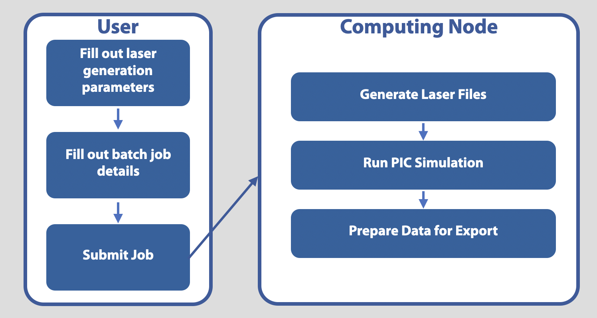

# Tutorial Simulation 

This tutorial goes over how to use this code to generate your laser and simulate it within a PIC simulation.
The example here uses the Smilei PIC software and is setup to run on a SLURM style HPC.

## Steps to Run the Simulation

### Step 1: Defining the initial parameters
The parameters for this simulation that the user may want to change are found:

1. Laser Generation Parameters:

`/fourier_prop/laser_input/laser_parameters.py`

`/fourier_prop/laser_input/propagation_parameters.py`

`/fourier_prop/laser_input/advanced_parameters.py`

2. PIC Interpolation and Simulation Parameters:

`/fourier_prop/read_laser/sim_grid_parameters.py`

3. PIC Namelist:

`/tutorial_sim/laser_only_sim.py`

### Step 2: Filling out the user details for the batch job
The user will submit a batch job to the HPC through the `/tutorial_sim/run_tutorial_sim.sub` file. This file
tells the HPC to generate the laser and run the PIC simulation. The user needs to replace a few placeholders
with their own information:
`USER`, `PARTITION`, `EMAIL`, and `/PATH/TO/Smilei/`

Once that information is set, it's ready to be submitted.

### Step 3: Submit the batch job
On the hpc, within the `/tutorial_sim` directory, run `sbatch run_tutorial_sim.sub`. Once the job is complete,
all of the simulation diagnostics and files will be found in the `/tutorial_sim` directory.

## Breakdown of run_tutorial_sim.sub
The `run_tutorial_sim.sub` script has 3 main components to run:
1. Generate the laser field
2. Run the PIC simulation
3. Prepare the data for export

### 1. Generating the laser field
The laser field is generated by using `mpirun` to call `/generate_laser.py`
with multiple cores. The output of the laser generation is saved in `tutorial_sim/laser_outfile.out`.
The `generate_laser.py` file first generates the input E field in frequency space.
Next, it uses the `propagator` module to propagate the field to the desired propagation
distance. Then it converts the output field from frequency space to time space. Finally,
it interpolates the field to the PIC simulation grid. All of these laser files are
saved in the `DATA_DIRECTORY_PATH` directory (defined in `/fourier_prop/laser_input/propagation_parameters.py`).

### 2. Running the PIC simulation
Once the laser field files are saved, the job script calls Smilei to run the
`/tutorial_sim/laser_only_sim.py` namelist as  PIC simulation. Within the namelist file,
it uses a custom laser block and pulls the laser files via the `read_laser` module:

```python
by_func = read_laser.get_By_function(propagation_parameters.DATA_DIRECTORY_PATH, sim_grid_parameters)
bz_func = read_laser.get_Bz_function(propagation_parameters.DATA_DIRECTORY_PATH, sim_grid_parameters)
Laser(
    box_side="xmin",
    space_time_profile=[by_func, bz_func]
)
```

The `by_func` and `bz_func` return functions. These functions take as input `y, z, t` and output
`By` or `Bz` from the field files saved earlier. While the simulation is running, the PIC software will probe these functions on the `y, z, t` grid
of the simulation at the laser entrance window (usually at `x=0`). 

### 3. Preparing the data for export
The `prep_file_for_happi.sh` is a quick fix to remove the custom laser field logic from the output `smilei.py`
file, which was causes a dependency problem when trying to analyze the output data.

The `del_large_files.sh` removes all of the stored laser files.

The `get_gifs.py` file creates nice gifs of the laser field.

Finally, the `export_sim.sh` file zips all of the simulation data and gifs into a single file
so that it's easy to download off of the HPC.
